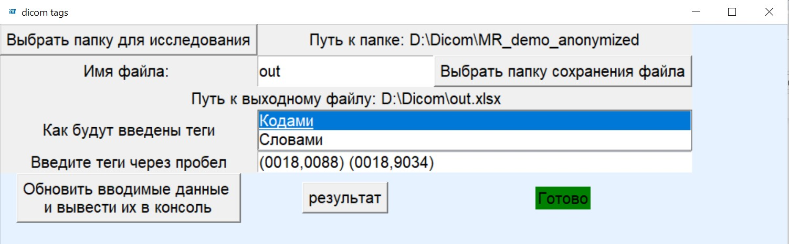

# программа для извлечения DICOM тегов 
#### Программа позволяет извлекать вводимые с клавиатуры DICOM теги из папки с несколькими папками, в каждой из которых есть набор dicom файлов
---

### используемые библиотеки
1. ast
2. tkinter
3. openpyxl
4. pydicom
5. pandas
6. os

### начало работы (без EXE)
1. установить все необходимые библиотеки
2. установить programm_with_interface

### начало работы (EXE)
1. установить все необходимые библиотеки
2. установить programm_with_interface
3. выполнить команду __pyinstaller -F --collect-submodules=pydicom programm_with_interface.py__ в командной строке в директории, где хранится программа __programm_with_interface.py__
4. в папке __dist__ появится файл __programm_with_interface.exe__

### инструкция по работе
#### при открытии программы откроется окно программы и дополнительная консоль
1. выбрать папку для исследования
2. ввести название выходного файла
3. выбрать способ ввода тегов
4. ввести теги через пробел 
5. нажать кнопку "Обновить вводимые данные и вывести их в консоль", после чего в консоли появится вся вводимая информация
6. нажать кнопку "результат", после чего в случае успешной работы программы, появится кнопка готово и файл с результатом отобразится в указанной папке. В случае если возникнет ошибка, надпись "готово" не будет отображена, сообщение об ошибке будет выведено в консоль.

#### Правильное заполение (слова)

#### Правильное заполение (коды)

#### Сообщение консоли

#### Файл вывода
#### Вунтренние папки исследуемой папки разделены "-"